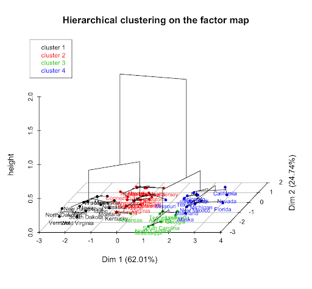

# Opencv Calibration Sample Code Customization

Now, we will customize OpenCV's original [calibration.cpp](https://github.com/the-other-mariana/vision/blob/master/calibration/opencv-sources-samples-cpp/calibration.cpp) file so that we can adjust to the method and pattern we will use. This file can be found at: `C:\OpenCV-4.2.0\opencv\sources\samples\cpp`, while all the example input images and files are found at: `C:\OpenCV-4.2.0\opencv\sources\samples\data`.

Source: https://github.com/the-other-mariana/vision/blob/master/calibration/calibration/calibration/calibration.cpp

### Run the Code

1. Open a C++ Visual Studio project.

2. Right click over the solution file and go to Project Properties.

3. Select Debugging.

4. Type in Command Arguments text box what would de the cmd command line of the .exe:

```
$ -w=6 -h=8 -s=0.025 -o=camera.yml -op -oe data/calibration.yml
```

## Error Scatter Plot

By running the calibration sample with the opencv input images, we get a view:


And if we plot the error scatter with a scale factor of 1000:


## Handy Links

### Hierarchical Clustering



circlesgrid.cpp (line 125):

```c++
//the largest cluster can have more than pn points -- we need to filter out such situations
if(clusters[patternClusterIdx].size() != static_cast<size_t>(patternSz.area()))
{
    return;
}
```

Then in the function:

```c++
void CirclesGridClusterFinder::getSortedCorners()
```

it seems that the sorting is based on distances from the centers to the corners found (squares' corners) and then they use that distance to know the orientation of the lines (clockwise / counterclock wise) and they find the `firstCorner` (line 329). They search for this `firstCorner` inside the convex hull of all the points, they start a loop from that index and over the convex hull sorted points, and they push them to the final sortedCorners vector (line 339).

To our pattern, it seems like also this function is useful:

```c++
bool CirclesGridFinder::findHoles()
```